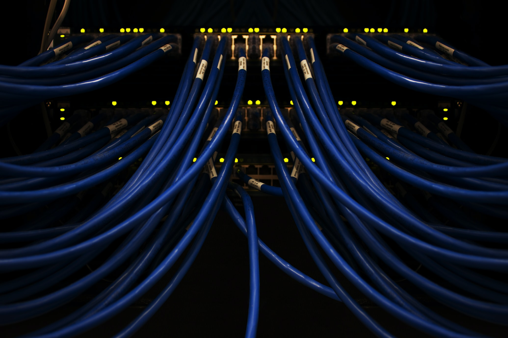

The rapidly evolving field of software development often feels like navigating through a complex maze. New trends, technologies, and strategies continually emerge, each promising to be the game-changer. Among these, one concept has increasingly stood out for its transformative potential - Immutable Infrastructure.

_This article was co-authored with the assistance of artificial intelligence, OpenAI’s GPT-3._

<!-- more -->

<figure markdown="span">

<figcaption markdown="span">

Photo by [Zoltan Tasi](https://unsplash.com/@zoltantasi?utm_content=creditCopyText&utm_medium=referral&utm_source=unsplash) on [Unsplash](https://unsplash.com/photos/brown-rock-formation-surrounded-by-green-grass-QxjEi8Fs9Hg?utm_content=creditCopyText&utm_medium=referral&utm_source=unsplash)

</figcaption>

</figure>

A ground-breaking shift from traditional Mutable Infrastructure, Immutable Infrastructure embodies the principle of immutability borrowed from functional programming. But, what does it truly entail? How can it be effectively implemented? Moreover, why does it hold such a critical place in today's software development and IT landscapes?

In this article, we will demystify Immutable Infrastructure, delving into its understanding, relevance, and vital considerations for implementation. Whether you're a seasoned IT professional or a beginner venturing into the tech world, this deep dive into Immutable Infrastructure promises to offer valuable insights.

So, buckle up as we embark on this fascinating journey through the compelling world of Immutable Infrastructure - a concept that isn't just a passing trend, but an enduring, transformative strategy worth embracing. Stay with us till the end and don't forget to [subscribe to our newsletter](http://techbrasa.com/subscribe) for more deep-reaching discussions.

## **Understanding Immutable Infrastructure**

<figure markdown="span">

<figcaption markdown="span">

Photo by [Scott Rodgerson](https://unsplash.com/@scottrodgerson?utm_content=creditCopyText&utm_medium=referral&utm_source=unsplash) on [Unsplash](https://unsplash.com/photos/a-bunch-of-blue-wires-connected-to-each-other-PSpf_XgOM5w?utm_content=creditCopyText&utm_medium=referral&utm_source=unsplash)

</figcaption>

</figure>

Immutable Infrastructure refers to an approach where infrastructure components are replaced instead of being updated. In this model, once a component is deployed, it remains unchanged, and all modifications are made through the deployment of new components. This marks a clear departure from the traditional Mutable Infrastructure, where changes are made by updating existing components.

To better understand, let's consider an example. In a mutable infrastructure, when deploying a new version of an application, the process typically involves connecting to an existing server, pulling the new application version, and updating the existing application.

However, in Immutable Infrastructure, an entirely new server is provisioned, and the application is deployed onto this fresh server. Once it's up and running, the traffic is then redirected from the old server to the new one. This way, if anything goes wrong during the deployment, you can swiftly switch back to the old server, minimizing potential downtime and risks.

The concept of immutability originates from functional programming, where data remains immutable, meaning it never changes. A function takes input and produces output without altering the original input. When this principle is applied to infrastructure management, it gives rise to the concept of Immutable Infrastructure.

This approach offers several significant advantages over mutable infrastructure:

1. **Consistency**: By eliminating modifications to the infrastructure, the environment maintains consistency throughout different stages of the development lifecycle. This reduces the risk of inconsistencies causing failures. For instance, imagine deploying a web application across multiple servers. With Immutable Infrastructure, you can be confident that all servers run the exact same configuration since they were set up from the same image. This eliminates the potential for "configuration drift," a common issue in Mutable Infrastructures where subtle differences accumulate over time as individual servers are updated or modified.

3. **Reliability**: Immutable Infrastructure mitigates the risk of failed deployments and system failures resulting from changes in the infrastructure. Consider a scenario where a server in a cluster encounters an issue. In a traditional approach, you would log into the server, diagnose the problem, and make necessary changes to fix it. However, in an Immutable setup, the faulty server would be replaced with a new one, significantly reducing the time and effort spent on debugging and problem resolution.

## **The Enduring Relevance of Immutable Infrastructure in Software Development**

In the modern era of software development, characterized by trends such as microservices, containerization, and serverless computing, the need for efficient and effective ways to manage infrastructure has become paramount. Immutable Infrastructure is the answer to this need, providing a scalable, reliable, and simpler approach to managing your digital environment.

An environment built on Immutable Infrastructure principles results in significantly fewer errors, as developers are not continually modifying the existing state of the infrastructure. Once an instance is launched, it remains the same throughout its lifetime. All updates, patches, or changes are implemented by entirely replacing old instances with new ones, not by revising them. This strategy ensures a more stable and dependable environment.

From the perspective of DevOps Engineers, Cloud Architects, and all stakeholders in the software development process, adopting Immutable Infrastructure brings significant advantages. These include less configuration drift and fewer inconsistencies between environments, increased speed of deployments, and reduced failure rates.

Furthermore, Immutable Infrastructure embodies the 'Infrastructure as Code' (IaC) philosophy, allowing the infrastructure setup to be versioned and treated just like application code. This increases the traceability of changes and makes the entire process more reliable and efficient.

In summary, Immutable Infrastructure, as a key element of modern software development, offers distinct advantages that make it an attractive strategy for managing infrastructure amid evolving software development paradigms. As we hustle through the ever-changing landscape of technology, Immutable Infrastructure is not just a passing trend, but an enduring and vital concept worth embracing.

## **Implementing Immutable Infrastructure: Key Considerations**

<figure markdown="span">

<figcaption markdown="span">

Photo by [Volodymyr Hryshchenko](https://unsplash.com/@lunarts?utm_content=creditCopyText&utm_medium=referral&utm_source=unsplash) on [Unsplash](https://unsplash.com/photos/3x3-rubiks-cube-toy-inI8GnmS190?utm_content=creditCopyText&utm_medium=referral&utm_source=unsplash)

</figcaption>

</figure>

Implementing Immutable Infrastructure involves a shift in mindset and practices from traditional infrastructure management. Here are some key considerations to keep in mind:

1. **Automated Infrastructure Provisioning**: To replace instances effectively, you need to automate your infrastructure provisioning process. Tools like Terraform, AWS CloudFormation, and Google Cloud Deployment Manager can help.

3. **Configuration Management**: Tools like Chef, Puppet, Ansible, or SaltStack can be used for configuration management. However, in an Immutable Infrastructure, they're used only when provisioning new instances, not for making changes to running instances.

5. **Containerization**: Containers are an excellent way to implement Immutable Infrastructure. Tools like Docker can package an application and its dependencies into a standalone unit that can be run anywhere.

7. **Version Control**: Just like application code, your infrastructure code should also be kept under version control. This allows you to keep track of changes, rollback when needed, and collaborate more effectively with your team.

9. **Disaster Recovery and Backups**: While Immutable Infrastructure reduces the risk of failures, it's still crucial to have a disaster recovery plan in place. Regular backups are essential, and you need to ensure that you can restore your entire infrastructure from these backups if necessary.

11. **Monitoring and Logging**: Monitoring your infrastructure and setting up robust logging is vital to identify any issues quickly. Tools like AWS CloudWatch, Logstash or Fluentd could be incredibly useful in this aspect.

13. **Security**: Security is a crucial aspect of any infrastructure setup. Ensure that your security policies are well-defined and implemented in your infrastructure code. Regularly update your instances to include the latest security patches.

If you're considering implementing Immutable Infrastructure principles, it's important to remember that it may require changes to your organization's culture and practices. The shift can indeed be challenging, but the potential benefits of increased reliability, speed, and simplicity make it well worth the effort.

Towards the end of this insightful journey, if your curiosity is piqued and you wish to delve deeper into such transformative concepts, consider following our **[Medium](http://techbrasa.com/medium)** articles. Our content is designed to engage and enlighten tech professionals at any level, from beginners to veterans.

## Looking Ahead

<figure markdown="span">

<figcaption markdown="span">

Photo by [Miguel A Amutio](https://unsplash.com/@amutiomi?utm_content=creditCopyText&utm_medium=referral&utm_source=unsplash) on [Unsplash](https://unsplash.com/photos/man-sitting-on-bench-near-body-of-water-during-daytime-8EB0jEOP_4c?utm_content=creditCopyText&utm_medium=referral&utm_source=unsplash)

</figcaption>

</figure>

As we delve into the world of software development, Immutable Infrastructure emerges as a key element, pivotal to embracing more reliable, consistent, and efficient systems. The potential for improved productivity, reduced risks, and streamlined processes makes it a worthy addition to any tech professional's toolkit.

Whether you're a seasoned DevOps Engineer, a Cloud Architect designing large-scale systems, a developer navigating the intricacies of backend development, or just starting your immersive journey into IT, the understanding and application of Immutable Infrastructure can significantly enhance your arsenal.

Immutable Infrastructure’s alignment with current trends like microservices, containerization, and serverless computing is more than mere serendipity—it signals the trajectory of effective infrastructure management as we move forward. It also resonates with the 'Infrastructure as Code' (IaC) philosophy, further emphasizing its relevance in this evolving landscape.

Navigating the complexities of software development and IT may be daunting, but the implementation of principles like Immutable Infrastructure can guide us through a smoother path.

Moreover, as we explore these thrilling concepts, we're not just enhancing our individual knowledge and skills. Every stride we take shapes the future of technology and contributes to an ecosystem of continuous learning and shared knowledge. And isn’t that what the spirit of technology and innovation signifies?

As we draw this discussion to a close, I invite you to journey with me. Follow this insightful exploration and many more to come on our **[Medium page](http://techbrasa.com/medium)**. Let's delve together into the exciting concepts molding the future of IT, enriching ourselves one blog post at a time.
