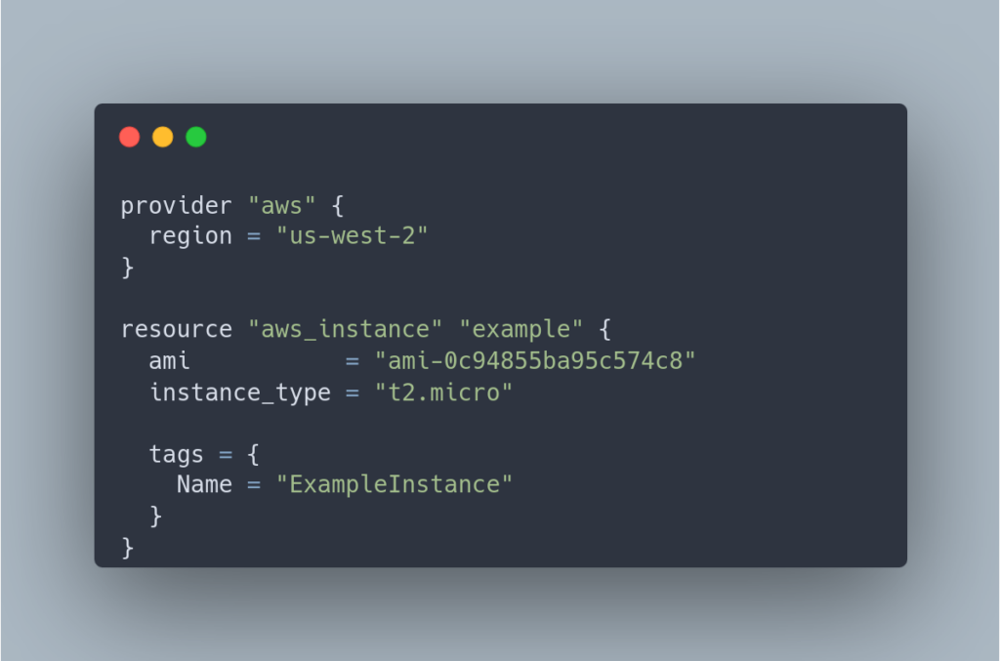
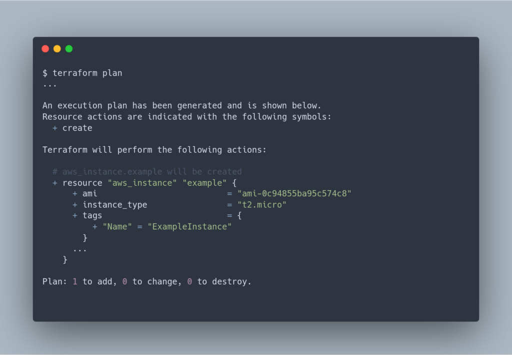
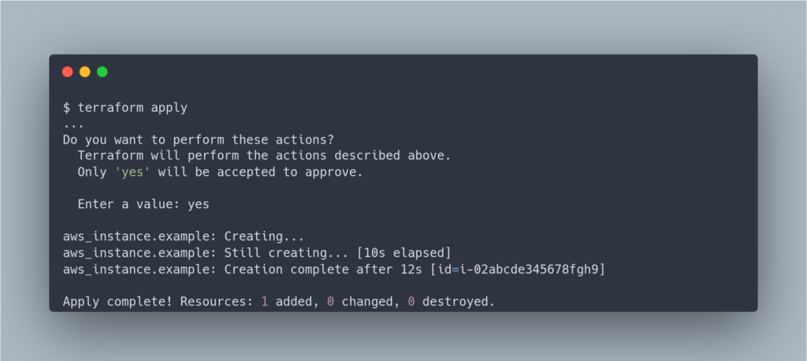

In the complex and ever-evolving world of information technology, efficient infrastructure management has been an ongoing challenge. Into this landscape, Terraform emerged as a potent solution. As an Infrastructure as Code (IaC) tool, Terraform has revolutionized how developers and system administrators manage and provision IT infrastructure. This article offers a glimpse into what Terraform is, how it operates, why it stands out, and delves into the learning resources and community surrounding this remarkable tool.

<!-- more -->

## **Understanding Terraform: What It Is and How It Works**

### **What is Terraform?**

Terraform is an open-source Infrastructure as Code (IaC) software tool created by HashiCorp. It’s designed to help developers define and provision data center infrastructure using a declarative configuration language. The usage of Terraform enables the infrastructure configuration of applications to be codified, making it replicable and manageable similarly to how software code is treated.

> _Want to stay up-to-date with the latest news on Terraform and other IaC tools? Subscribe to our newsletter to get regular updates right in your inbox. [Click here to subscribe right now!](https://techbrasa.com/subscribe)._

### **The Core Principle of Terraform: Write, Plan, Create**

The essence of Terraform's operation lies within its principle of **"Write, Plan, and Create."** During the "Write" phase, engineers code the desired state of the infrastructure. The definition of the desired state is accomplished through HashiCorp Configuration Language (HCL), which is a declarative language. This language allows you to describe what you want to accomplish (the 'end state') rather than the steps to get there.

### **The 'Plan' Phase Unveiled**

After the desired state of infrastructure is declared using HCL, the "Plan" phase ensues. During this phase, Terraform generates an execution plan that outlines the necessary steps to reach the desired state. To achieve this, Terraform constructs a graph of resources, where each resource (such as a virtual machine, security rule, network, etc.) represents a node, and the dependencies between resources are established through edges connecting these nodes.

For example, when a virtual machine relies on a specific network, both the virtual machine and the network are represented as nodes on the graph, with an edge connecting them to signify the dependency. By leveraging this graph, Terraform determines the most efficient sequence for creating, modifying, or removing resources. It calculates the optimal order in which these actions should be performed to achieve the desired state of the infrastructure.

Moreover, Terraform has the capability to execute operations concurrently for resources that are independent of each other and do not have any interdependencies. This parallel execution feature can significantly expedite the application of changes. As a result, Terraform generates a comprehensive roadmap that outlines the specific actions needed (such as additions, modifications, and deletions) to achieve the desired state without causing disruptions to unrelated existing resources.

### **The Final Act: Create**

The last phase, "Create," involves Terraform carrying out the changes outlined in the plan. During this phase, Terraform utilizes a concept known as "providers." These providers act as intermediaries between Terraform and cloud service providers such as AWS, Azure, and Google Cloud. By leveraging providers, Terraform translates the HCL code into API calls specific to each cloud provider, enabling seamless and direct interaction with the underlying infrastructure's APIs. This allows Terraform to effectively provision and manage resources within the chosen cloud environment.

By following this approach, Terraform empowers users to have a clear visualization of the anticipated changes, instilling confidence in the actions that Terraform will execute. This pre-visualization capability ensures an efficient and predictable infrastructure management process. Terraform's robust and feature-rich approach establishes a solid foundation for effectively managing complex infrastructures. It enables users to navigate and orchestrate their infrastructure with greater control, allowing for streamlined operations and enhanced overall efficiency.

> _Interested in exploring the power of Terraform? DigitalOcean has a Terraform provider that makes managing your cloud infrastructure a breeze. [Start using the Terraform provider for DigitalOcean right now.](https://techbrasa.com/digital-ocean)"_

## **The Journey to Terraform**

### **The Evolution of Infrastructure Management**

In the early days of managing servers and infrastructure, the task posed a considerable challenge. System administrators were required to manually configure each component of the system, resulting in a time-consuming process that was susceptible to human errors. Recognizing the need for a more efficient solution, configuration management tools like Puppet, Chef, and Ansible emerged. These tools simplified server management by enabling the application of desired configurations across multiple servers. However, they were primarily based on a mutable infrastructure approach.

In this model, infrastructure was frequently updated and modified in real-time, which could lead to instability and less reliable systems.

### **Terraform and the Immutable Infrastructure Paradigm**

Introducing Terraform, a tool that brings forth the revolutionary concept of immutable infrastructure. Instead of simply updating or modifying an existing system, Terraform advocates for completely replacing the old system with a new one whenever a change is required. This approach ensures greater reliability and predictability in system operations.

Terraform treats infrastructure as code, allowing changes to be made through new deployments. This approach not only enhances security but also promotes stability. With Terraform, managing infrastructure becomes more efficient and consistent, streamlining the tasks of developers and system administrators alike.

## **Why Terraform Stands Out**

Terraform has gained widespread recognition and popularity due to its features and capabilities:

- **Supports Multiple Providers**: Unlike some tools that are specific to a single cloud provider, Terraform is provider agnostic. With support for a wide range of providers such as AWS, Google Cloud, Azure, and more, Terraform allows users to manage diverse technologies across different cloud platforms using a unified workflow. This versatility makes Terraform an invaluable tool in the complex world of multi-cloud environments.

- **Immutable Infrastructure**: Terraform takes an innovative approach by treating infrastructure as immutable. Unlike traditional configuration management tools that update existing servers, Terraform creates new resources to replace the old ones when changes are needed. This approach minimizes risks and unintended consequences, ensuring reliable, stable, and predictable systems that behave exactly as intended.

- **Modular and Reusable**: Terraform promotes modularity and reusability through its module system. Modules are collections of related resources managed as a group. They can be used across different parts of your Terraform code, reducing redundancy and improving code organization. This modular approach streamlines maintenance and makes it easier to update shared components of your infrastructure.

- **Declarative Syntax**: With Terraform, users describe the desired state of the system, and the tool takes care of figuring out how to achieve that state. This declarative syntax simplifies the configuration process and helps prevent errors that can occur with procedural configuration scripts. It provides an intuitive and clear way to describe complex IT infrastructures.

These remarkable features set Terraform apart as a powerful and versatile tool for managing infrastructure-as-code, establishing it as a benchmark in this space.

> _For more insights and in-depth analysis on Terraform and other emerging technologies, check out our articles on Medium. [Visit our Medium page here](https://techbrasa.com/medium)._

## **Terraform's Community and Learning Resources**

The strength of Terraform is further enhanced by its vibrant global community and the availability of various learning resources. Through forums, user groups, and conferences, Terraform users can collaborate, share knowledge, and learn from each other.

- **Forums and User Groups**: Terraform's community actively engages on various online platforms. The **[HashiCorp Community Forum](https://discuss.hashicorp.com/c/terraform-core/27)** and **Stack Overflow** serve as valuable spaces where users can ask questions, share solutions, and discuss best practices. Additionally, LinkedIn and Facebook host numerous user groups where members exchange information and learn from one another.

- **Conferences**: HashiCorp, the company behind Terraform, organizes an annual conference called **[HashiConf](https://hashiconf.com/)**. This event is dedicated to the community surrounding HashiCorp's products and provides a platform for participants to deepen their knowledge about Terraform through a range of talks, workshops, and training sessions.

- **Documentation and Tutorials**: The **[official Terraform documentation](https://www.terraform.io/docs/index.html)** is a comprehensive resource that offers insights into how the tool operates. It includes a quick start guide, tutorials, and a detailed list of Terraform commands and functions. Additionally, platforms like YouTube, Udemy, and Coursera provide video courses and tutorials catering to different levels of expertise, from introductory Terraform content to advanced guides.

Access to learning resources is crucial for mastering Terraform as they empower both new users and experienced practitioners to explore, experiment, and enhance their skills with the tool.

* * *

In summary, Terraform has become an essential tool for IT professionals worldwide. Its innovative approach of considering infrastructure as code brings unparalleled efficiency and predictability to infrastructure management. The strength of Terraform is further enhanced by its vibrant global community and the abundance of learning resources available. Whether you're starting your journey into Infrastructure as Code or are an experienced veteran in the field, Terraform provides the necessary tools and support to successfully navigate the complex landscape of IT infrastructure management.
