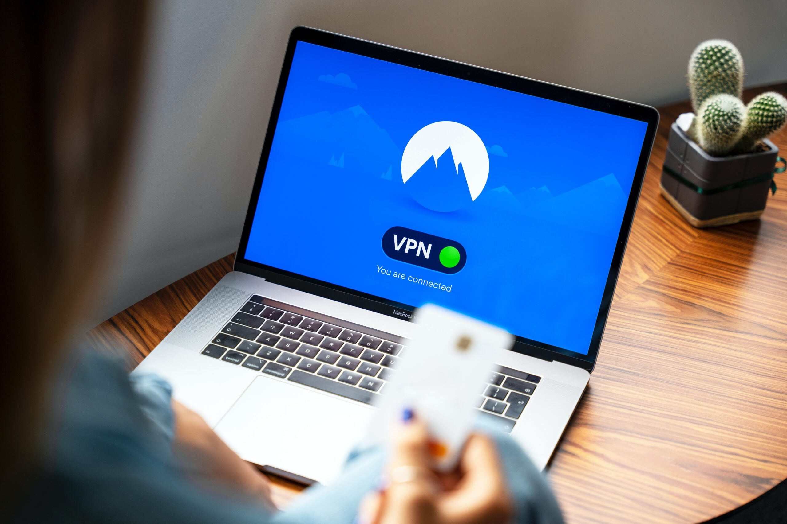

Technological advancements in the digital era have significantly linked all aspects of our lives, turning the online world into our central hub for acquiring knowledge, communication, recreation, and more. But this facility comes at a price - our online privacy and security. As we immerse ourselves deeper into the boundless cyber landscape, we are exposed to diverse hazards and hurdles. However, fear not, as we have an influential tool at our disposal to fight these looming threats: a Virtual Private Network, or VPN.

<!-- more -->

The purpose of this article is to clarify the notion of VPNs. We will explore the definition of VPN, its pivotal role in fortifying our digital lives, the dangers of an unshielded internet connection, and key factors to consider when selecting an appropriate VPN that serves our distinct requirements. On top of this, we will feature a select list of the top 5 VPN services at hand, equipping you with the necessary knowledge to make a well-informed decision. Armed with this power of knowledge, we can traverse the cyber landscape with confidence in pursuit of a safer and more private online experience.

To keep abreast with the recent developments in the technology domain, we encourage you to [subscribe to our newsletter](http://techbrasa.com/subscribe).

## What's a VPN, Anyway?

In our rapidly evolving digital world, where every online movement is watched and noted, maintaining internet privacy can turn into a Herculean task. That's where our digital cape, a Virtual Private Network (VPN), comes in handy. Designed notably to boost online safety, a VPN builds a secure tunnel for your data to travel without prying eyes scanning it across the broad cyber terrain.

Picture this: when you switch on a VPN, your device creates a friendly handshake with a server somewhere on the internet. It's like borrowing someone else's internet connection to browse the web. This borrowed connection is encrypted, sort of like a secret language that only you and the server understand. So, your data wears this protective cloaking, making it invisible to any nosy parkers trying to snoop into your online affairs – be it crafty hackers, peeping internet service providers (ISPs), or curious government bodies.

But that's not all. Using a VPN is akin to putting up a digital smoke screen. Your web traffic seems to originate from the VPN server, effectively disguising your IP address – just like a unique internet postcode assigned to you. The result? Your online persona, geographical whereabouts, and browsing trail stay cloaked, gifting you a veil of mystery that helps shield you against potential cyber predators.

But remember, while VPNs play the role of a protective knight in your online adventure, they aren't perfectly invincible. Yes, they give you a sturdy shield of security when you venture into the world wide web, but theoretically, your VPN provider could still note down your deeds. Hence, choosing a VPN provider is a bit like choosing a trustworthy ally. Make sure they aren't the types who spill your secrets, and you'll ensure your online privacy and security.

## Why Should I Care About VPNs?

At this point, you're likely wondering why VPNs are fast becoming a must-get pass in the bustling digital cityscape. Allow me to unravel the mystery.

### **Keeping Secrets Safe**

In this age where data is the new gold, holding your online life close to your chest matters more than ever. Think of a VPN like a cloak of invisibility over your IP address and a secret code for your data in transit, ensuring your online actions stay between you and your screen.

### **Tower of Defense**

With cyber threats morphing every day, it's time to upgrade our fortress. Whether you're logged onto a café's Wi-Fi or connected at the airport's hotspot, your device becomes a juicy target for prowlers. A VPN wraps your data in a shield of encryption, making it a tough nut to crack for prying eyes, even on public networks.

### **The Global Explorer**

Jealous of your friend in another country watching that exclusive show? Geo-restrictions often throw a damper on our cyber exploration. Fear not, because a VPN lets you play digital hide and seek. It masks your IP address, making it look like you’re sailing the web from a different dock, unlocking content you wouldn’t typically have access to.

### **Bypassing The Speed Bumps**

Ever notice a dip in your internet speed when you binge-watch too much? That's your Internet Service Provider (ISP) creating a speed bump, also known as bandwidth throttling, based on your cyber activities. A VPN throws a spanner in the works by encrypting your online traffic, leaving your ISP in the dark about your escapades, and effectively stopping them from curbing your online voyage.

### **Being the Invisible Man/Woman**

Each click leaves a digital footprint, and before you know it, you've left a whole trail for trackers. Using a VPN, you can don the cap of the invisible man or woman, ensuring your online endeavors remain your treasured secrets.

### **Tranquil Webbing**

There's a proverbial sigh of relief in the knowledge that your online life is private and your data is safe. Be it eCommerce shopping, whispering digital secrets in emails, or just aimlessly roaming the digital landscape, a VPN paints your experience with a stroke of calm.

Living in a world where your life is intertwined with the internet, a VPN is like a digital empowerment tool. It lets us hold the reins of our personal info and guarantees a safe and private adventure in the virtual world.

* * *

## Navigating the Cyber Sea Without a Safety Net: The Risks

Sure, the internet – the bustling cityscape of data and global connections – opens windows to a world of possibilities. But, like any fast-paced city, it's filled with risk, particularly for those who explore it without a protective armor. Let's venture into the perils lurking in the digital shadows when your internet voyage lacks a sturdy shield:

### **The Data’s Darkest Enemies**

Without a secure, encrypted line of communication, your confidential data — everything from intimate email conversations to sensitive financial details — are sitting ducks for cyber looters. These cunning digital thieves are always on the prowl, seeking opportunities to breach unsuspecting data fortresses. The fallout? From financial casualties to shattered identities, the aftermath can be near catastrophic.

### **Identity Impersonators**

The internet is a playground teeming with identity snatchers. They exploit insecure connections to pilfer individual details like your name, address, and, most alarmingly, credit card information. Equipped with your personal dossier, they can disguise as you, possibly draining your pockets and tarnishing your name.

### **The Unseen Eyes**

In our digital age, companies often play the role of unseen eyes, tracking your cyber escapades to understand and analyze your online behavior, mostly to craft personalized advertising strategies. Without a sturdy shield, your browsing tendencies, tastes, and even your geographic position can be tracked, recorded, and stored.

### **The Nasty Digital Bugs**

The internet is awash with nefarious digital critters, including viruses, spyware, and ransomware. Without a proper cyber-armor, your device is a tempting target and risks falling sick, leading to data loss, sluggish performance or, in dire cases, complete system hijack.

### **The Phishing Lures**

Crafty cyber tricksters often weave complex phishing schemes to lure innocent surfers into revealing their sensitive information. Posing as trustworthy digital entities, they con unsuspecting people into spilling their personal and financial secrets.

### **ISP Peepers**

Did you know, your Internet Service Providers (ISPs) could play the watchman, monitoring, cataloging, and even trading your browsing chronicles, posing a stark invasion of your privacy?

See, the internet, like a powerful sword, could defend or destroy, based on how we wield it. By embracing preventive steps like using a VPN, you can shoo these risks back into the shadows and sail the digital ocean safely and with peace of mind. Because your online safety isn't a gamble, it's a sure-bet with the right precautions.

## Picking the Perfect VPN: What to Look For

Choosing a VPN service is like picking your digital bodyguard. You're entrusting your digital safety to it. So, like a good hiring manager, you need to think carefully and choose wisely. When sizing up potential VPN candidates, here's your checklist:

### **The Security Buff**

A VPN's security prowess is its muscle. Poke around to see if it flexes features like 256-bit encryption, which is akin to a digital Fort Knox. Other security buddies like OpenVPN or IKEv2 are critical as they help create a safe pathway and translate your data into gibberish for unwanted audiences. Opt for a VPN that hires these or other reliable protocols on its security team.

### **The Privacy Advocate**

A VPN's privacy policy is its manifesto. Check that your VPN candidate sticks to a stern no-logs policy. This ALLOWS your online activities to STAY your own private soap opera, without any sneaky peeping Toms. Especially handy if your mission is to don the cloak of online anonymity.

### **The Global Explorer**

The count and location of servers a VPN offers is its passport to the world. It's not all about the numbers but also where these servers are shaking their hands from. A VPN with a multitude of server connections across multiple countries is like having keys to the internet's global playground.

### **The User Whisperer**

Unless you're a tech whizz, some VPNs can feel like figuring out a complicated treasure map. Look for a VPN that speaks your language and leads you smoothly around, making sure your VPN journey feels like a walk in the park.

### **Worth Every Penny**

Free VPNs, though tempting, often come with strings attached and might even put your security at risk. Think of them as cheesy tabloids that sensationalize your data to generate revenue. Premium VPNs, though a bit of an investment, come stacked with features, iron-clad security, and privacy principles, making them the tried-and-true choice for digital safety.

### **The Help Beacon**

Aim for VPNs that offer efficient and ready-to-assist customer support. If you hit a roadblock or are scratching your head about something, swift and helpful support can guide you out of the maze.

### **The Speed Racer**

A VPN that lets the snail win the race against your internet connection can be a buzzkill. Keep an eye out for a VPN offering the gift of unlimited bandwidth and turbo-charged servers ensuring you fly through your virtual errands without slumping the performance.

Ticking off this checklist while scouting for your VPN can help you zero in on a service that's a glove-fit for your needs and serves up robust protection, paving the way for a secure and cheery online sojourn."

## Exploring the Best VPN Services for Your Digital Protection

In today's increasingly digital world, maintaining online privacy and security is paramount. Naturally, Virtual Private Networks (VPN) services have become an essential tool, helping us to keep our online activities private and secure. However, with a plethora of VPN services available in the market, picking the right one can be a tough nut to crack.

To ease this decision-making process, let's dive deep into the world of VPNs and unravel the top 5 VPN services you should consider for your digital peace of mind.

### **Decoding NordVPN**

Known as an elite player in the VPN industry, [NordVPN](https://techbrasa.com/nord-vpn) shines bright when it comes to maintaining your online anonymity. They have a staunch no-logs policy, ensuring that your digital footprints vanish the moment you disconnect.

Apart from fortifying your digital privacy, NordVPN goes a step beyond, helping you aplenty in bypassing geo-restrictions with its network of over 5000 servers scattered across the globe. Its intuitive and user-friendly interface encapsulates a rewarding experience, making it a beloved choice for both VPN first-timers and pros.

### **The ExpressVPN Experience**

Standing strongly by its name, [ExpressVPN](https://www.expressvpn.com/) offers a high-speed, anonymous, and secure VPN service that ticks all right boxes for digital nomads. It boasts a sprawling network of servers, paving the way for unrestricted internet access and effortlessly bypassing geographical restrictions.

Security is ExpressVPN's forte, utilizing state-of-the-art encryption methodologies to shield your valuable online data. To top it all, it supports a wide range of devices, ensuring that your online safety isn't compromised, whatever device you may be on.

### **Unveiling CyberGhost VPN**

If you're the one for whom privacy stands atop all, [CyberGhost VPN](https://www.cyberghostvpn.com/en_US/) could be your perfect partner. The defining factor? Their pre-configured profiles, custom-crafted for various scenarios such as anonymous surfing, secure torrenting, or stutter-free streaming. These profiles simplify the VPN setup process and provide an uncomplicated, personalized experience.

### **Spotlight on Surfshark**

Although a newbie in the neighborhood, [Surfshark](https://surfshark.com/) is rapidly becoming the darling of the VPN world. Its rock-solid security framework and stringent no-logs policy ensure your online privacy isn't breached.

But that's not all. Surfshark stands out from the crowd with its policy of allowing unlimited devices on a single subscription - a feature multidevice users would love.

### **A Peek into Private Internet Access (PIA)**

Not just a name, [P](https://pia.vpn/)[I](https://www.privateinternetaccess.com/)[A](https://pia.vpn/) brings you the power to shape your VPN experience. It provides an array of customization options, letting you fine-tune everything from encryption levels to preferred connection protocols. Coupling this freedom with a strict no-logs policy and strong encryption practices, PIA brings together adaptability and safety on the same table.

While these are the VPN services that are expected to align best with most users' needs, remember, your choice should pivot around your unique requirements and circumstances. Consider all decisive factors - security protocols, privacy policies, server locations, user interface, and of course, pricing.

Choose a VPN service wisely. It's an investment in your online safety and privacy - an investment that guarantees peace of mind in the digital realm. It's time to take the first step towards protecting your online presence today by choosing a VPN that resonates with your digital lifestyle.

## Reclaiming Your Digital Existence

Yes, we're part of an intricately connected digital world, a world that has bestowed upon us countless benefits, conveniences, and opportunities. However, it's equally important to remember that this digital marvel doesn't come without its unique pitfalls and risks. After all, your safety and privacy on the infinite highways of the internet aren't always guaranteed unless we make it a priority.

That's where a Virtual Private Network (VPN) comes into play, functioning as a steadfast digitized guardian that ensures the sanctity of your online presence.

Regardless of who you are — a techie, a student, a creative mind, or anyone who spends even a bit of their day online, a VPN is not just an asset. It's a necessity in the contemporary virtual world. It amplifies your online journey by giving you the liberty to sail through various websites without the fear of being monitored or having your data stolen, thus putting you in control of your privacy.

It's high time you equip yourself with the power of a VPN and reclaim your digital sovereignty. Prioritizing your online safety is no longer just an option; it's a critical imperative in this digital age, and investing in a credible VPN service is a tactical step towards creating that protective shield.

If you're up for joining the great conscious crowd of tech enthusiasts who are ardent about their digital security, consider [subscribing to our newsletter](http://techbrasa.com/subscribe). Declare your love for tech wisdom, captain your digital ship, and equip yourself with vital trends, hacks, and security alerts that we churn out regularly.

Also, be part of our prospering digital tribe on [Medium](http://techbrasa.com/medium) and [LinkedIn](http://techbrasa.com/linkedin) to stay in sync with the latest updates and engage in enriching conversations with fellow tech enthusiasts.

Before you embark on the fascinating journey of digital exploration, make sure you’re equipped with the best safety gears. With a dependable VPN as your sidekick, you can tread the thrilling terrain of cyberspace with confidence and peace of mind. Let’s continue this exciting journey into the digital world together, but more importantly, let’s navigate it smarter and safer.
