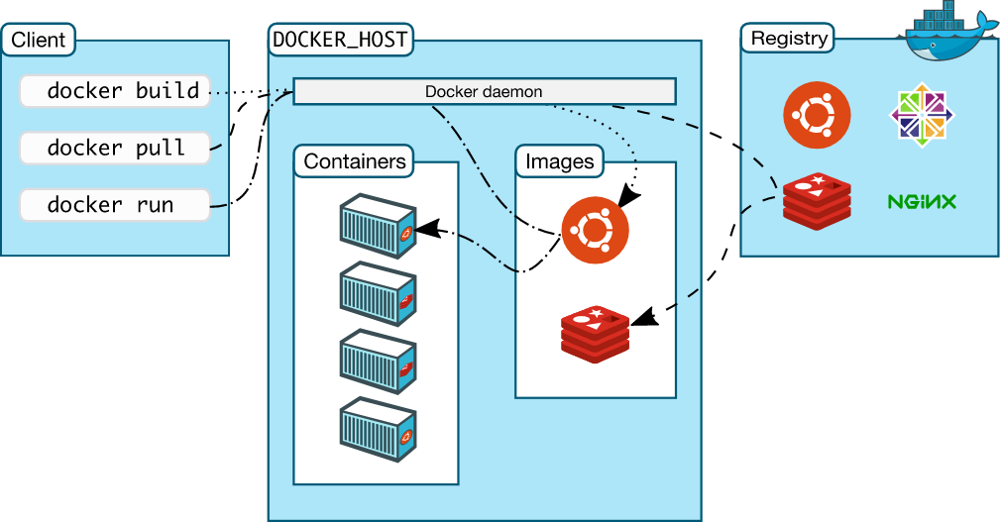

Navigating the oceanic expanse of DevOps tools, a beacon of efficiency and modernization shines brightly - Docker. Armed with the [power of containerization](https://techbrasa.com/demystifying-containers-future-software-development/), Docker offers a paradigm shift in the realm of application development and infrastructure management. It serves as a savior for developers scattered in the seas of complex coding structures, which not only run aground 'works on my machine' issues but also accelerate their voyage towards fast and efficient software deployment.

In this post, we delve deep into the world of Docker. We will unfurl the concepts of Docker and containerization, take you through the process of Docker image construction, managing Docker containers, and touch upon enhancing your development process with Docker.

<!-- more -->


Ready to channel your inner explorer and embark on this Docker-filled adventure? Anchor yourself in and let's set sail!

## Understanding Docker

In the sea of DevOps tools, Docker has emerged as a lifeboat for many developers. By introducing a containerization approach, Docker has changed how applications get packaged, shipped, and run across different environments.

### Exploring Docker's Solution: Containerization

One might perceive Docker containers as self-sufficient, portable packages inclusive of all prerequisites to run a given application. This universality across various environments effectively eliminates the notorious "it worked on my machine" dilemma that developers often face.

To understand this concept in a more comprehensive manner, we recommend [referring to our previously published post](https://techbrasa.com/demystifying-containers-future-software-development/) dedicated to dissecting containerization. This essential read serves as a fundamental step in your Docker mastery journey.

### Demystifying Containerization

Think of Docker containers as lightweight, standalone, executable packages that include everything needed to run a piece of software, regardless of the environment. When developers ship their applications in Docker containers, they eliminate the "but it worked on my machine" problem.

### The Empowering Docker Architecture



The Docker architecture, based on the client-server model, consists of the Docker Client, Docker Host, and Docker Registry. The Docker Client communicates with the Docker Daemon, which builds, runs, and manages Docker containers.

## Dockerization: Building and Running Containers

Jumping onto the Docker bandwagon involves building Docker images and managing Docker containers. To illustrate, let's make our first Docker image.

### Building a Docker Image

A Docker image is a lightweight, stand-alone, executable package that includes everything needed to run a piece of software, including the code, runtime, system tools, system libraries, and settings.

To construct a Docker image, we use a Dockerfile. The Dockerfile is a text file that contains all the commands, in order, needed to build a given image.

Here's a basic Dockerfile example:

```
# Use the official image as a parent image
FROM node:current-slim

# Set the working directory in container
WORKDIR /usr/src/app

# Copy the file from your host to your current location
COPY package.json .

# Run the command inside your image filesystem
RUN npm install

# Inform Docker that the container is listening on the specified port at runtime
EXPOSE 8080

# Run the specified command within the container
CMD [ "npm", "start" ]
```

Once the Dockerfile is ready, you can build the image using the `docker build` command, followed by a path to the Dockerfile location.

### Unpacking the Docker Image Building Process

The Docker image can be thought of as the blueprint for your Docker container - it packages up the code, runtime, libraries, and environment variables that your software requires to run. The magic behind this is the Dockerfile, which acts as the architect for your Docker image.

Let's walk through our example Dockerfile:

```
# Use the official image as a parent image
FROM node:current-slim
```

The `FROM` command defines the base image used to start the build process. In this case, it's a slim version of the latest Node.js image.

```
# Set the working directory in container
WORKDIR /usr/src/app
```

Next, the `WORKDIR` command sets the working directory in the Docker image. It's essentially the directory that we copy our files into and run our commands inside.

```
# Copy the file from your host to your current location
COPY package.json .
```

The `COPY` command is copying `package.json` file from your host system to the Docker image. The dot (`.`) represents the current working directory inside the image.

```
# Run the command inside your image filesystem
RUN npm install
```

Then, the `RUN` command executes `npm install` in the Docker image, installing all the dependencies defined in the `package.json`.

```
# Inform Docker that the container is listening on the specified port at runtime
EXPOSE 8080
```

The `EXPOSE` command informs Docker that the container will listen on the specified network ports at runtime. In this instance, our application will be accessible on port 8080.

```
# Run the specified command within the container
CMD [ "npm", "start" ]
```

Lastly, `CMD` specifies the command to execute when the container starts. In our case, it will run `npm start` to start our Node.js application.

When you're ready to build the image, you use the `docker build` command with a path to the Dockerfile (e.g., `docker build -t my-app .`). Docker reads the Dockerfile, performs the steps in order, and builds a Docker image on your host machine that you can use to start containers.

### Running Docker Containers

From your built image, you can establish a Docker container through the `docker run` command. Docker instantly loads and runs the specified image.

Learning to build and handle Docker containers could initially seem intimidating, but with practice and the right resources like [Docker's own documentation](https://docs.docker.com/), the journey to becoming a Docker adept is smooth sailing.

Ready to put theory into practice and make your Docker knowledge tangible? [DigitalOcean provides the ideal platform](http://techbrasa.com/digital-ocean) to start deploying your Docker containers. Their user-friendly interface, robust infrastructure, and incredible community are there to support and enhance your journey from Docker beginner to Docker expert. Dive in, start applying what you've learned, and watch your container deployments take flight.

## Dockerizing Your Development

Whether you are developing software, orchestrating microservices, setting up an isolated testing environment, or simplifying DevOps, Docker serves as an accompanying tool at every step. Embracing Docker broadens your technical horizon and helps you translate complex coding problems into flawless software execution.

Feel like these kinds of in-depth tech posts resonate with you? Ensure you never miss a beat by following us on [LinkedIn](http://techbrasa.com/linkedin).

The world of Docker and containerization is vast, but as you set out to explore it with patience and curiosity, rest assured that the rewards will be worth the effort. Let this exploration pave your way towards deeper knowledge, innovative solutions, and unprecedented milestones in your tech journey.

Ready for more? [Subscribe to our newsletter](http://techbrasa.com/subscribe) and fuel your tech exploration with insightful content!
