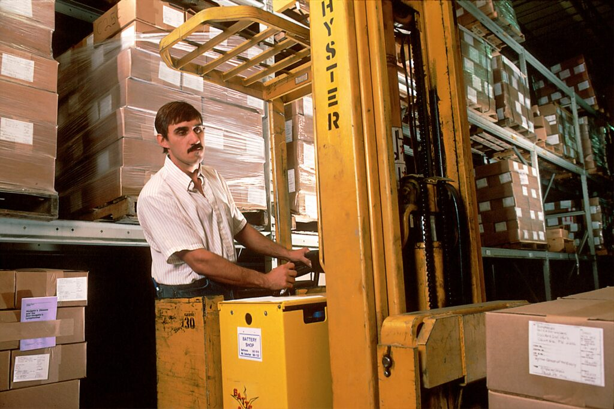

Containerization has revolutionized the way developers deploy and manage applications. In this post, we'll delve deep into the critical aspect of managing state and ensuring data persistence in containerized environments. This is more than just a technical explainer; it's a look into the strategic heart of modern application architecture.

<!-- more -->

<figure markdown="span">

<figcaption markdown="span">

Photo by [Jan Antonin Kolar](https://unsplash.com/@jankolar?utm_content=creditCopyText&utm_medium=referral&utm_source=unsplash) on [Unsplash](https://unsplash.com/photos/brown-wooden-drawer-lRoX0shwjUQ?utm_content=creditCopyText&utm_medium=referral&utm_source=unsplash)

</figcaption>

</figure>

## Understanding Containers and Their Stateless Nature

Let's peel back the layers and truly grasp the essence of container technology and its stateless nature. [Containerization](https://techbrasa.com/demystifying-containers-future-software-development/) is a method of packaging software so that it can be run with its dependencies in isolated environments called containers. This practice encapsulates an application and its dependencies into a portable and self-sufficient unit, which can be executed consistently on any computing platform that supports the container system, such as Docker, Kubernetes, or others.

Despite the advantages, containers are inherently stateless. By default, they are designed to be ephemeral and temporary — much like a hermit crab that can occupy different shells, a container can be stopped, destroyed, and recreated on a whim, without any intrinsic mechanism for preserving the state of the application it hosts. When a container is removed, the file system changes and data generated during its lifecycle are lost with it. This is an intentional design choice that supports the agility and flexibility of containerized applications, allowing them to be managed at scale. However, it poses a unique challenge: managing and persisting data across the container lifecycle.

In the next sections, we will explore how to conquer this challenge, ensuring that critical data remains persistent and available, no matter how dynamic our container environment might be. Understanding this balance between statelessness and persistence is key to mastering containerized applications — a topic that we will delve into with both the precision of a seasoned engineer and the insight of a strategic architect.

## The Challenge of Managing Data in Stateless Containers

<figure markdown="span">

<figcaption markdown="span">

Photo by [National Cancer Institute](https://unsplash.com/@nci?utm_content=creditCopyText&utm_medium=referral&utm_source=unsplash) on [Unsplash](https://unsplash.com/photos/yellow-driving-forklift-S-3AnKlICmY?utm_content=creditCopyText&utm_medium=referral&utm_source=unsplash)

</figcaption>

</figure>

As a software developer, DevOps engineer, or any tech enthusiast, you understand the ephemeral nature of containers. When your application scales up or relocates across environments, you need to ensure that user data, configurations, and application state remain intact.

Imagine a backend system losing all session data every time it restarts. Frustrating, right? That's why addressing data persistence is a cornerstone in containerized application design. But there's more to it than mounting a volume or choosing a database. It's about architecting resilient systems capable of weathering the transient lifecycle of containers.

**Do you want a deeper understanding of these principles?** [Subscribe to my newsletter](https://techbrasa.com/subscribe) to receive curated content that unboxes the complexities of state management in containers.

## Strategies for Data Persistence

### Volumes and Bind Mounts

Volumes are the most common way to persist data in Docker containers. They exist independently of the lifecycle of a container and allow storage to be shared between containers or between a container and the host system.

### StatefulSets in Kubernetes

Kubernetes StatefulSets are designed for applications that require stable, persistent storage, unique network identifiers, and ordered, graceful deployment and scaling. They maintain the state even if the pods are rescheduled to new nodes.

### Cloud-Native Storage Solutions

Cloud-native storage solutions such as Portworx, Ceph, and Rook have been developed to help manage complex storage needs in a dynamic container ecosystem.

### Maintaining Application State

Application state management in containers requires a deliberate approach. In-memory data stores such as Redis or Memcached can be used for caching session data, but they need persistent backing for durability. Similarly, databases like PostgreSQL or MongoDB can be containerized, but their data must be managed to survive container restarts.

## Beyond the Basics: The Persistent Data Patterns

<figure markdown="span">

<figcaption markdown="span">

Photo by [Egor Myznik](https://unsplash.com/@vonshnauzer?utm_content=creditCopyText&utm_medium=referral&utm_source=unsplash) on [Unsplash](https://unsplash.com/photos/a-pile-of-cut-logs-Tbh7-Uw3tX0?utm_content=creditCopyText&utm_medium=referral&utm_source=unsplash)

</figcaption>

</figure>

A deeper understanding of state and persistence in containers emerges from knowing the patterns. Some popular patterns include:

### The Sidecar Pattern: Enhancing Container Functionality

<figure markdown="span">

<figcaption markdown="span">

Photo by [Drew Beamer](https://unsplash.com/@dbeamer_jpg?utm_content=creditCopyText&utm_medium=referral&utm_source=unsplash) on [Unsplash](https://unsplash.com/photos/a-black-and-white-photo-of-an-old-motorcycle-_WcjaNV6cFY?utm_content=creditCopyText&utm_medium=referral&utm_source=unsplash)

</figcaption>

</figure>

One of the most compelling design patterns for managing container states and extending functionality is the Sidecar Pattern. It’s a concept borrowed from the motorcycle attachment of the same name — just as a motorcycle sidecar extends the capabilities of a motorcycle without altering its inherent functions, a sidecar container adds functionality to the main application container seamlessly.

The sidecar container runs in the same pod as the primary application container in a Kubernetes cluster, sharing the same lifecycle and resources. It’s tightly-coupled with the main application but serves a supportive role, performing supplementary tasks that the main container isn’t responsible for. This separation of concerns is a fundamental principle of modern architecture, enhancing the maintainability and scalability of applications.

#### Expanding Functionality Without Affecting the Core

Here's a deeper look into what a sidecar can do:

- **Logging:** A logging sidecar might gather logs produced by the main application, process them, and then direct them to a centralized logging service. This offloads the burden of log processing from the application, allowing it to run more efficiently.

- **Monitoring:** Similarly, a monitoring sidecar can observe the main application’s performance and send metrics to a monitoring system. It can also be responsible for health checks, ensuring that the application is running optimally and triggering alerts if not.

- **Configuration:** A configuration sidecar could manage real-time configuration updates for the main application. It can watch a configuration source and, upon detecting changes, automatically update the application or its environment without needing a restart.

- **Networking:** In networking, a sidecar proxy can manage traffic to and from the main container, handling tasks like service mesh interfacing, load balancing, or SSL termination.

- **Data Management:** When it comes to state and persistence, a sidecar can facilitate file syncing, data backup, and even promote data sharing between containers.

By embracing the sidecar pattern, developers can imbue the main application container with enhanced resilience and adaptability with respect to state management and data persistence. It also leads to cleaner application container images and a more focused application codebase, since the sidecar handles auxiliary features.

* * *

### The Adapter Pattern: Standardizing Container Communication

<figure markdown="span">

<figcaption markdown="span">

Photo by [Call Me Fred](https://unsplash.com/@callmefred?utm_content=creditCopyText&utm_medium=referral&utm_source=unsplash) on [Unsplash](https://unsplash.com/photos/two-white-power-adapters-on-white-background-nBfTARHPxiU?utm_content=creditCopyText&utm_medium=referral&utm_source=unsplash)

</figcaption>

</figure>

When you delve into the realm of containerized applications, you'll notice that handling outputs from various sources can become complex and unwieldy. Different applications and services may log data in their unique formats, and interpreting this heterogeneous data becomes a challenge. This is where the Adapter Pattern shines, simplifying the way we manage and interpret the diverse outputs of containerized applications.

#### Homogenizing Diverse Outputs

The Adapter Pattern serves as a translator between the application and the larger ecosystem it operates within. It adapts the output or data format of a container so that it aligns with other components of the system, much like an electrical adapter allows a device from one country to be plugged into a foreign socket with a different shape.

In practice, an adapter container sits alongside the main application container. Its sole responsibility is to convert the application's output into a uniform format that can be readily understood and processed by other parts of the system. Here’s what that might look like in a real-world scenario:

- **Log Adaptation:** If an application writes logs in a non-standard format, an adapter container can transform these logs into a standardized format before they are sent to a centralized logging platform. This ensures that monitoring and analysis tools can process these logs without requiring custom parsing logic.

- **Metric Transformation:** Similarly, if the application emits metrics that are not compatible with the monitoring tools in use, the adapter container can convert these metrics into a compatible format. This enables the monitoring system to read and interpret the data correctly, ensuring consistent and reliable monitoring.

- **Data Conversion:** In the context of data persistence, an adapter can translate data between the format used by the application and the format expected by the storage system. This is particularly useful when dealing with legacy systems or integrating with external services that require specific data schemata.

#### Benefits of the Adapter Pattern

The Adapter Pattern reduces the complexity that arises from having to accommodate a multitude of data formats within the same system. By centralizing the transformation logic within a dedicated container, developers are saved from having to write and maintain multiple parsing routines throughout their systems.

Moreover, should there be a need to change the logging or monitoring service, only the adapter container's logic would need to be updated, leaving the main application container untouched. This isolation fosters a cleaner codebase for the application and reduces the risk of introducing bugs when implementing changes to data parsing or processing.

* * *

### The Ambassador Pattern: Simplifying Container Networking

In the interconnected world of containerized deployments, the Ambassador Pattern emerges as a pivotal design strategy for abstracting networking complexities away from application containers. This pattern leverages a proxy container, known as an ambassador, to act as an intermediary for network communication. The ambassador container is responsible for handling outbound connections from the application container, providing a level of indirection and control that is both powerful and essential in a microservices architecture.

#### Facilitating Inter-Container Communication

Imagine the ambassador as a diplomatic representative in the world of networking, translating requests and managing communication channels on behalf of the application container. Here's how it functions in a typical setup:

- **Connection Proxying:** The ambassador container can act as a proxy for sending requests from the main application to other services. This means that the application container connects to the ambassador, which then relays the connection to the appropriate destination.

- **Managing TCP Connections:** TCP connections often require careful management to ensure efficiency and security. The ambassador can handle the creation, maintenance, and teardown of TCP connections, freeing the application from these tasks and allowing developers to focus on business-logic concerns.

- **Secure Channels:** In a security-conscious environment, managing secure channels is crucial. The ambassador can be responsible for implementing TLS encryption for inbound and outbound traffic, ensuring data is transmitted securely without involving the application's core logic.

- **Service Discovery:** In dynamic environments like Kubernetes, IP addresses and ports for services can change often. An ambassador container can integrate with service discovery mechanisms to dynamically route traffic to the right services without the application needing to be aware of these changes.

#### Streamlining Complex Networking Tasks

The Ambassador Pattern is particularly useful when the application needs to interact with external services like databases, APIs, or third-party SaaS providers. By having an ambassador handle these interactions, developers can abstract away the complexities of network programming, such as retry logic, circuit breaking, rate limiting, and authentication.

This pattern enables a microservices application to offload network-related concerns and remain agnostic of the underlying infrastructure. It can be a boon for testing, allowing developers to swap out real services for mock services simply by reconfiguring the ambassador, rather than altering application code.

**Would you like to master these patterns?** [Connect with me on LinkedIn](https://techbrasa.com/linkedin), where I share resources and guides on crafting and utilizing these patterns for robust containerized architectures.

## Considerations for Stateful Applications

When dealing with stateful applications like databases, queues, or any service that needs to retain data, there are additional considerations:

- **Backup and Restore Processes:** Regularly backing up your data is crucial. One must also ensure that there is a reliable and tested restore process in place.

- **Disaster Recovery:** In case of a catastrophic failure, having a disaster recovery plan that includes data replication across different geographic locations can save the day.

- **Data Security:** Data managed by stateful applications often include sensitive information. It’s essential to implement encryption at rest and in transit, as well as robust access controls.

Understanding and implementing these considerations is non-trivial.

* * *

## The Persistent Importance of Data Management

As containers continue to be a linchpin in the world of software engineering, the dialogue around them must transition from mere usage to intricate understanding. This includes grasping the nuances of state management and data persistence — a challenge that all tech professionals must contend with.

Become part of a community that thrives on the frontier of technological innovation. Whether you're scaling containers or persisting data, I'm here to help you navigate the complexities. [Subscribe, follow, and connect](http://techbrasa.com/subscribe) today for a smarter tomorrow.
