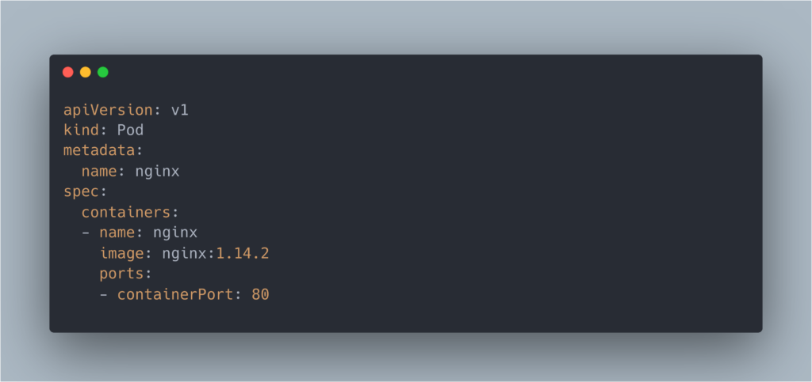

Welcome to the first entry in our blog series guiding you through your journey to ace the Certified Kubernetes Administrator (CKA) certification. Throughout this series, we'll delve into my personal notes from a comprehensive preparation course, unraveling the intricacies of Kubernetes bit by bit. Whether you're a seasoned professional or just starting out, these insights will help bolster your understanding and prepare you for the challenges of the CKA exam. Let's embark on this learning quest together and take the first step towards Kubernetes mastery.

<!-- more -->

<figure markdown="span">

<figcaption markdown="span">

Photo by [Windows](https://unsplash.com/@windows?utm_content=creditCopyText&utm_medium=referral&utm_source=unsplash) on [Unsplash](https://unsplash.com/photos/woman-in-blue-long-sleeve-shirt-and-blue-denim-jeans-sitting-on-bed-using-laptop-v94mlgvsza4?utm_content=creditCopyText&utm_medium=referral&utm_source=unsplash)

</figcaption>

</figure>

_Are you ready to kickstart your path to becoming a Kubernetes expert? [Follow along with our series and take the leap towards achieving your CKA certification!](https://techbrasa.com/subscribe)_

## Introduction to Kubernetes

Kubernetes is an open-source container orchestration tool that has revolutionized the way containerized applications are managed across different environments. This system offers essential functionalities for maintaining and scaling applications, such as high availability, scalability, and disaster recovery. Understanding these concepts is the first step for any professional aiming to obtain the Certified Kubernetes Administrator (CKA) certification.

## Key Components of Kubernetes

Within the Kubernetes architecture, there are several key components that you need to master:

- **Node**: A physical or virtual machine that hosts Pods.

- **Pod**: The smallest unit in Kubernetes, representing an abstraction over a container. Each Pod has a unique IP address and typically runs one application per Pod. Remember that Pods are ephemeral, meaning they can be terminated easily.

- **Service**: While Pods have IP addresses that can change, a Service provides a stable communication point with a permanent IP, acting as a load balancer among different Pods.

- **ConfigMap**: Allows for the external configuration of your applications, ideal for non-confidential values.

- **Secrets**: Similar to ConfigMap but intended for storing secret data. Note that by default, secrets are stored unencrypted in etcd.

- **Volume**: Refers to storage that can be located on the local machine or remotely but outside of the Kubernetes cluster.

- **Deployment**: Functions as a blueprint to create and manage Pod replicas, ideal for stateless applications.

- **StatefulSet**: Meant for stateful applications or databases, which are often hosted outside of the Kubernetes cluster.

- **DaemonSet**: Similar to a Deployment, but ensures that a Pod replica runs on each Node of the cluster.

> _Ready to take a giant leap in your career? Visit the [Linux Foundation Kubernetes Certification page](https://techbrasa.com/go/kubernetes-fundamentals-cka-certification/) to get all the details you need to register for the CKA exam. Don't just prepare; become certified and join the ranks of Kubernetes experts across the globe!_

## Kubernetes Architecture: Worker and Control Plane

### Worker Machine

Each Node contains multiple Pods and must have three processes installed:

- **Container Runtime**: Responsible for running containers (e.g., containerd, Docker, cri-o).

- **kubelet**: Acts as an interface between the container runtime and the Node.

- **kube-proxy**: In charge of forwarding requests to the correct Pods.

### Control Plane

The Control Plane consists of four fundamental processes:

- **Api Server**: The cluster gateway, acting in authentication and access to the cluster.

- **Scheduler**: Responsible for scheduling new Pods on Nodes.

- **Controller Manager**: Detects changes in state and adjusts to achieve the desired state.

- **etcd**: A key-value store that serves as the cluster's brain.

## Managing Resources in Kubernetes

To interact with Kubernetes, the command-line tool `kubectl` is used, along with manifest files, which are YAML documents describing the configuration of resources you want to create or modify.

### Imperative vs Declarative

- **Imperative**: Uses only `kubectl` for direct actions, useful for quick testing.

- **Declarative**: Employs configuration files to maintain a history and implement infrastructure as code, favoring collaboration and transparency.

### Configuration Files

The configuration files of Kubernetes consist of three main parts:

1. **Metadata**: Information about the resource, such as name and labels.

3. **Specification (Spec)**: Specific details of the resource to be created.

5. **Status**: _Automatically generated_ by Kubernetes, reflecting the resource's current state.

These YAML files must follow strict indentation and are ideal for storing alongside your application code.

## **Important Disclaimer: The Key to Certification Success is Practice**

While this blog series aims to provide you with comprehensive insights into the core concepts and components of Kubernetes, it is paramount to acknowledge that real-world practice is the cornerstone of mastering any skill. Achieving success in the Certified Kubernetes Administrator (CKA) certification requires not only theoretical knowledge but also hands-on experience with the technology.

We strongly encourage you to complement the information presented in this series with practical exercises and real-life implementations of Kubernetes. Setting up your own clusters, experimenting with different configurations, and troubleshooting common issues will significantly enhance your understanding and aptitude in Kubernetes.

Remember, the path to certification is not just about memorizing information; it's about embedding these skills into your professional repertoire through diligent practice. We urge all readers to allocate sufficient time for practical application alongside their study to ensure the best chances of certification success.

Embrace the learning process, and let practice be your guide to achieving excellence in the CKA examination and beyond.

## Conclusion

As we wrap up the first installment of our series, remember that mastering the Kubernetes Core Concepts is just the beginning. Stay tuned for more insights and detailed walkthroughs of the various facets of Kubernetes in our upcoming articles. Take this knowledge forward and continue to practice and explore – your dedication will be the cornerstone of your success on the CKA examination.

_Eager to continue your CKA journey? Don't miss out on our upcoming articles in this series. [Subscribe to our newsletter](https://techbrasa.com/subscribe) and ensure you're the first to access these valuable resources!_
