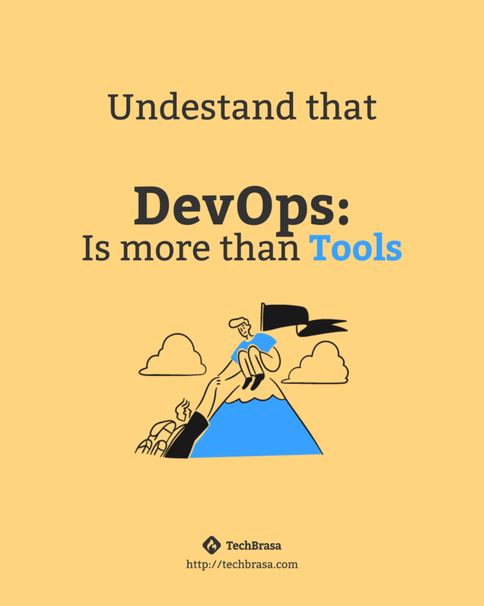

You know that famous answer from a senior developer: “It depends”?

In my last article, [I explained why roles like DevOps Engineer, Platform Engineer, and SRE, as appealing as they might seem, do not serve the true purpose of DevOps](https://techbrasa.com/what-the-devil-teaches-me-about-devops/). However, I realized I might have overlooked some main points about DevOps.

<!-- more -->

## DevOps is like personal development

Based on the experience of several individuals, including my own, and observing the lack of understanding among some recruiters, I notice that these roles are often associated with "people who know how to install, configure, and use tools." However, this is not necessarily DevOps.

Let me emphasize: DevOps is not about tools, at least not exclusively! DevOps is about people, processes, and, finally, tools.

DevOps involves a certain hierarchy among these three principles, where the foundation is people. From there, we define the processes which, when applied, help identify bottlenecks, leading us to implement tools to enhance productivity.

To me, this is very similar to our personal development. First, we identify who we are, where we want to go, and our limitations. Next, we define processes to act, create habits, and finally apply tools that enhance these habits and generate even more results.

## Habits need time, and need to be atomic

It seems like the market is saying: “Put Kubernetes in everything, CI/CD will change everything.” Hold on, these are tools – not bad ones, but they come later. To be truly effective, other things need to happen first: the team must know how to communicate, be open to change, share knowledge, present their challenges, and learn from mistakes.

Groups are made up of people, and as such, we need to understand how to acquire habits and evolve. You can't tell someone who's never been to a gym that tomorrow they will be ready for Mr. Olympia. It doesn't work that way – there's a process, and processes take time.

A well-applied DevOps culture should be seen as this process that takes time and needs to be practiced daily, built, and incorporated into the routine. When it becomes routine, the tools exist to take this routine to another level.

Tools are, indeed, important; many of them have enabled the successful implementation of the DevOps culture. However, it's not just the tools that will make your software deliver faster. The entire team working in the development flow must know the processes and live the DevOps culture.

## Going to the next level

If you're tired of empty labels and want to understand the true meaning of DevOps, it's time to take the next step. Schedule a free conversation with me and discover how our intensive can transform your approach, focusing on people, processes, and finally, on the right tools.

Click the button below to secure your spot and start your journey towards a more effective and genuine application of DevOps in your career.

[How to make DevOps the right way!](https://techbrasa.com/go/intensivo-devops-jeito-certo/)
