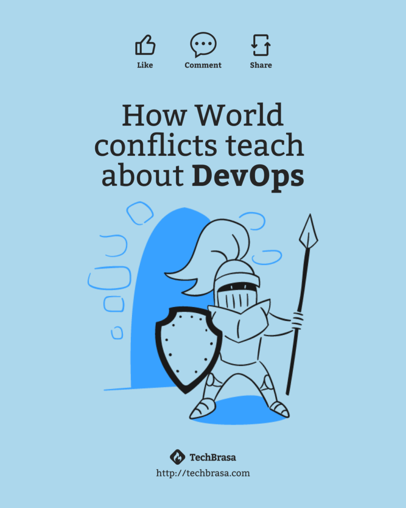

Again, hold on, I'm not here to talk about religion.

<!--  -->

One of the characteristics that gave rise to the DevOps movement can be clearly observed in the conflict: the tendency to "throw things over a wall" and use this mess as a barrier to accuse the other side.

<!-- more -->
## Wall of confusion

Until the early second decade of this millennium, the software development environment faced a significant problem. Teams were separated into silos, created by the groups themselves.

A silo is when a team shares a set of common tasks but operates differently from other groups, so the group's "power" is centered on the roles they perform or the technical knowledge they possess.

Imagine your group of friends who share common interests—those were the silos in the software development and delivery environment.

On one side, the developers, who always had a disruptive and agile mindset, wanting to implement changes quickly. On the other, the IT operations team, focused on ensuring trust in the running product, delivery quality, and preventing production issues.

The problem arises when one side depends on the other. How do we align expectations? Do we continue in a childish blame game, each accusing the other for not thinking the same way?

This is an issue many companies still face: the difficulty in software development and delivery.

## DevOps: The solution

DevOps emerged as a third way, a means to harmonize both sides. However, any kind of relationship requires exchanges, behavior changes, and cultural transformations within a company.

The solution lies in developers beginning to understand the environment in which their creations will run and the operations team learning about the need for agility in implementations. Everyone wins. It seems perfect, and it really can be.

If you're a developer, be willing to understand the operations team's need for something more robust, resilient, and of quality. The same goes for the operations team: be open to explaining to the devs how things work behind the scenes. Each possesses incredible and unique technical knowledge; sharing this knowledge produces extraordinary results.

## Breaking the wall

It's time to move past the silos and barriers in your development team. Join our exclusive intensive and learn how to effectively apply DevOps principles throughout your organization. Whether you're a developer, part of the operations team, or any other role in the software development cycle, this intensive is for you.

Click the button below to schedule a free conversation and discover how we can help you achieve more effective collaboration and impressive results.

[Avoid conflicts, and be the difference in the IT!](https://techbrasa.com/go/intensivo-devops-jeito-certo/)
