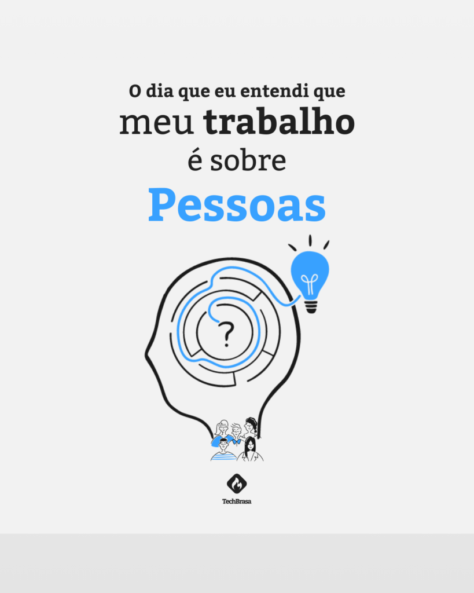

<!--  -->

When I entered the IT field, I thought it would be easier to avoid personal interactions. I struggled with interpersonal relationships, and despite being communicative, it exhausted me. Listening, speaking, sharing knowledge—all these require stepping outside of oneself to connect with others.

Initially, IT seemed like the perfect field for this. For a time, I managed my career with minimal interpersonal contact. However, I soon realized the reality was different.

As a DevOps Engineer, my job required constant interaction with front-end, back-end, and full-stack developers. I had to deal with project leaders, POs, PMs, and also the QA team.

<!-- more -->

## The Big Change

After 2.5 years in this role, I had one of the best experiences of my career. I was integrated into a project from the beginning, participating in architecture and planning meetings, and collaborating directly with testers and developers. This experience allowed me to understand the true value of my work.

Being involved in all stages, from Agile to continuous delivery automation, was invigorating. I realized that DevOps is not just about tools; it is a complex set of skills that need to be applied practically and effectively.

The true transformation in software development comes with a mindset shift. We need to understand that while we work with code, frameworks, containers, and pipelines—all tools—the end goal is people. The aim is to improve the quality of work and ensure that the service delivered is the best it can be.

## The real purpose of IT

The purpose of software development is not just to move cards on the Kanban board. It's to simplify and speed up the lives of the people who use your product. This is the true value that software development brings to businesses and, most importantly, to people's lives.

If you, as a developer, QA, PO, DevOps, or SRE, think that your only goal is to complete your tasks, you're deviating from the true path. You're moving backward in your career.

Throughout my experience, I developed a method that helped me understand this, allowing me to sleep and live better, knowing I’m fulfilling my true role. I would like to share this with you. If you're interested, schedule a free consultation. I'll share my experience and offer the necessary tips for you to reach this understanding too.
